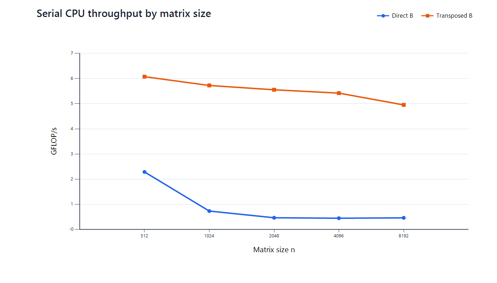
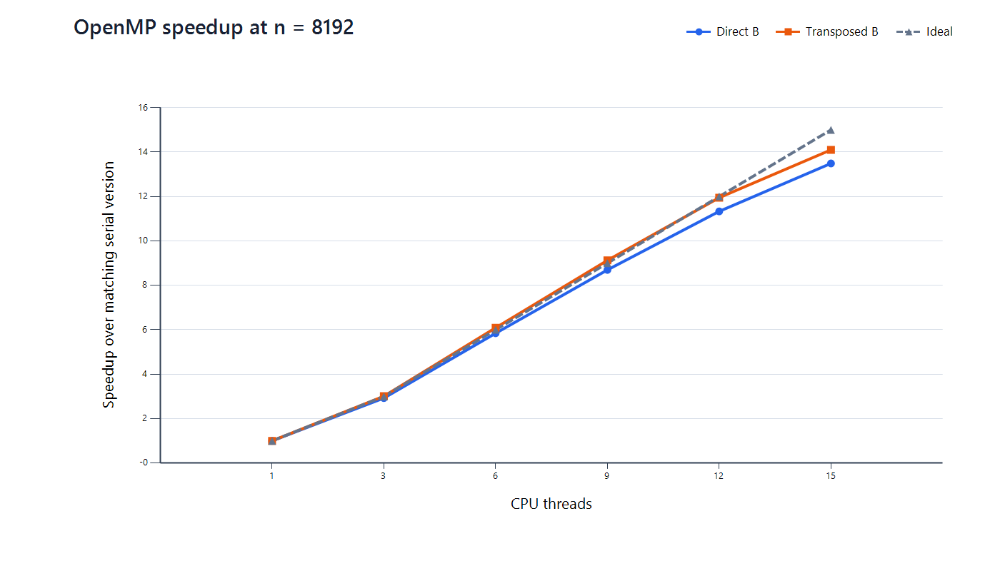
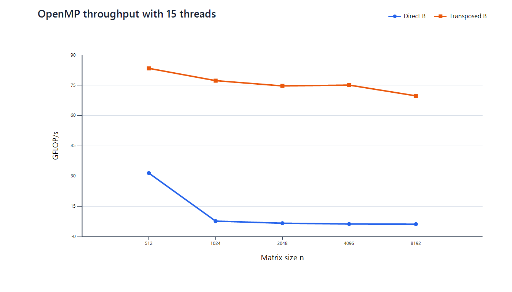
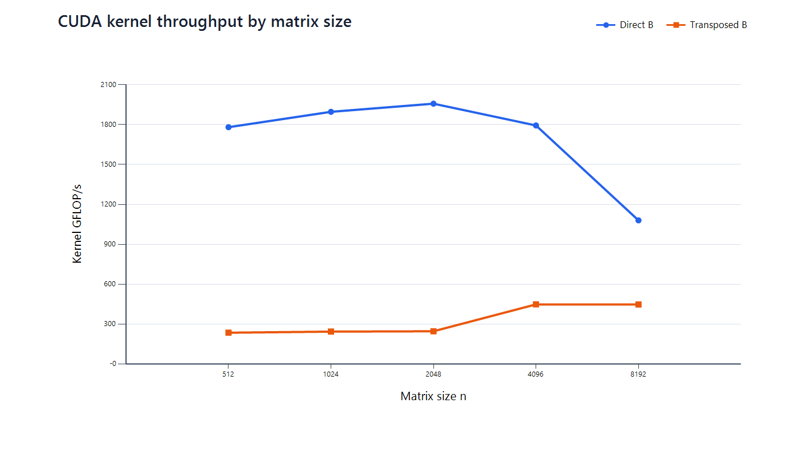
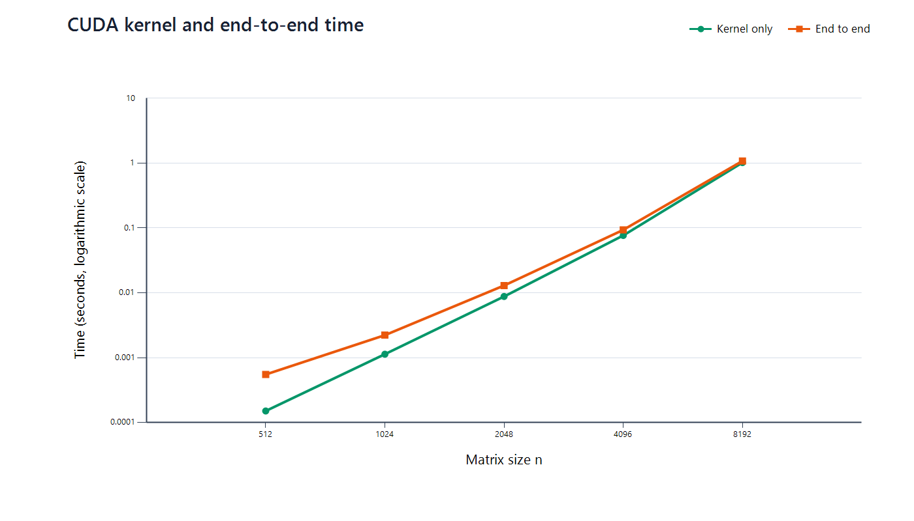
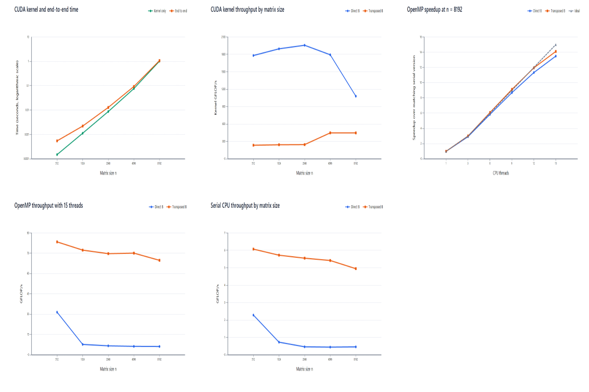

# HPC: Matrix Multiplication

*Memory layout and parallel scale on CPU and GPU*

**Eric Zephyr Smith, S326060093**  
**Gao Kailong, S326067100**

Harbin Engineering University

***


# Section 1: What Is the Problem

***

## Research question

How do memory layout and parallel scale affect a simple dense matrix multiplication on CPU cores and a CUDA GPU?

For row-major square matrices:

$$
C_{ij}=\sum_{k=0}^{n-1}A_{ik}B_{kj}
$$

All six implementations perform approximately $2n^3$ floating-point operations. We vary:

- the physical layout of the second input matrix
- the number of CPU threads
- the execution platform: CPU or GPU

The experiment studies performance effects without changing the mathematical result.


***

## Sequential computation

The serial `i-j-k` kernel uses one CPU thread.

```text
for each output row i
    for each output column j
        sum = 0
        for k = 0 ... n-1
            sum += A[i,k] * B[k,j]
        C[i,j] = sum
```

The thread completes the full dot product for `C[i,j]`, stores the result, and then moves to the next output element.

For one output element:

$$
C_{ij}=A_{i,0}B_{0,j}+A_{i,1}B_{1,j}+\cdots+A_{i,n-1}B_{n-1,j}
$$


***

## Parallel decomposition of the output matrix

The $n^2$ output elements are independent after $A$ and $B$ are initialized.

```text
Serial CPU                 OpenMP CPU                 CUDA GPU

one thread                 each CPU thread           each CUDA thread
owns all rows              owns a group of rows      owns one C[row,col]

row 0                      thread 0: rows 0...r       thread (0,0): C[0,0]
row 1                      thread 1: next rows        thread (1,0): C[0,1]
row 2                      thread 2: next rows        thread (0,1): C[1,0]
...                        ...                        ...
```

Each worker still completes the full $k$-loop for every output element it owns. The implementation does not split one dot product across workers, so it needs no cross-thread reduction and has no conflicting writes to $C$.


***

# Section 2: State of the Art

***

## Memory movement in high-performance GEMM

Modern GEMM implementations organize the computation around the memory hierarchy:

- cache-sized blocking keeps reused data near the CPU cores
- packed panels provide contiguous input streams
- register microkernels reuse values for several output elements
- GPU tiles combine coalesced global loads with reuse in shared memory and registers

Goto and van de Geijn describe the layered blocking and packing used by high-performance CPU GEMM.

This project intentionally uses simple, untiled kernels and disables CPU auto-vectorization. The controlled design exposes the effects of layout and parallel mapping rather than peak GEMM performance.

References: [Goto and van de Geijn, *Anatomy of High-Performance Matrix Multiplication*, ACM TOMS 2008](https://www.cs.utexas.edu/~flame/books/ACMTOMS.pdf) and [Netlib SGEMM](https://www.netlib.org/lapack/explore-html/d4/de2/sgemm_8f_source.html)


***

## CPU locality and OpenMP work sharing

A cache line transfers several adjacent values at once. Performance improves when the program uses most of the transferred values before eviction.

```text
Direct B                         Transposed B

B[0,j] B[1,j] B[2,j] ...        BT[j,0] BT[j,1] BT[j,2] ...
   ^      ^      ^                  ^       ^       ^
 stride n between loads            adjacent float loads
```

OpenMP worksharing distributes loop iterations among a thread team. With `schedule(static)` and no explicit chunk size, the implementation assigns approximately equal parts of the outer row loop to the threads.

*References: [OpenMP API Specification 5.2, Worksharing-Loop Constructs](https://www.openmp.org/spec-html/5.2/openmpse66.html) and [OpenMP static scheduling semantics](https://www.openmp.org/spec-html/5.0/openmpsu41.html)*


***

## GPU thread mapping and memory coalescing

The CUDA grid maps the $x$ coordinate to output columns and the $y$ coordinate to output rows.

```text
thread (col, row)
        |
        +-- computes C[row,col]
        +-- loops over all k
```

At a fixed $k$, neighboring threads in a warp evaluate neighboring output columns:

```text
Direct B:      B[k,j]     B[k,j+1]     B[k,j+2]      nearby addresses
Transposed B:  BT[j,k]    BT[j+1,k]    BT[j+2,k]     stride n
```

CUDA combines the addresses requested by a warp into global-memory transactions. Fewer transactions and a higher ratio of useful bytes improve effective bandwidth.
*Reference: [NVIDIA CUDA Programming Guide, Coalesced Global Memory Access](https://docs.nvidia.com/cuda/cuda-programming-guide/02-basics/writing-cuda-kernels.html#coalesced-global-memory-access)*

***

## Limits to parallel speedup

Increasing the thread count reduces the amount of output assigned to each CPU thread. Scaling can still lose efficiency because of:

- thread creation and synchronization overhead
- shared cache and memory-system pressure
- serial setup work and data movement
- frequency, power, and thermal limits

Amdahl's analysis formalizes how a non-parallel fraction limits speedup. This experiment measures the actual effect instead of assuming linear scaling. Reference: [G. M. Amdahl, *Validity of the Single Processor Approach to Achieving Large Scale Computing Capabilities*, AFIPS 1967](https://doi.org/10.1145/1465482.1465560)

$$
S(p)=\frac{T_1}{T_p}, \qquad E(p)=\frac{S(p)}{p}
$$


***

# Section 3: Methodology

***

## Six controlled implementations

| Version | Execution | Work decomposition | Second-matrix access |
| --- | --- | --- | --- |
| v1 | Serial CPU | one thread owns all $C$ | `B[k*n + j]` |
| v2 | Serial CPU | one thread owns all $C$ | `BT[j*n + k]` |
| v3 | OpenMP CPU | static groups of output rows | `B[k*n + j]` |
| v4 | OpenMP CPU | static groups of output rows | `BT[j*n + k]` |
| v5 | CUDA GPU | one output element per thread | `B[k*n + col]` |
| v6 | CUDA GPU | one output element per thread | `BT[col*n + k]` |

CPU versions use the same scalar `i-j-k` loop. CUDA versions use the same $16\times16$ block shape. The arithmetic performed for each output element remains unchanged.

***

## Correctness validation

The inputs use dense, nonzero, low-rank values with a closed-form product:

$$
A_{ik}=x_i u_k, \qquad B_{kj}=v_k y_j
$$

$$
C_{ij}=x_i y_j\sum_{k=0}^{n-1}u_kv_k
$$

Every implementation still executes the complete $O(n^3)$ multiplication. After each timed run, the validator visits every output element and compares it with the closed-form result in $O(n^2)$.

The acceptance threshold is:

$$
|C_{ij}-C_{ij}^{expected}|\le 10^{-4}\max(1,|C_{ij}^{expected}|)
$$

All recorded runs report `verified = 1` and `max_abs_error = 0`. Validation is outside the timed region.

***

## Measurement protocol

- Matrix sizes: **512, 1024, 2048, 4096, 8192**
- OpenMP thread counts: **3, 6, 9, 12, 15**
- Five repetitions for every configuration
- Reported value: minimum of repetitions 2 through 5
- CPU timing: monotonic host clock around multiplication only
- CUDA kernel timing: CUDA events
- CUDA end-to-end timing: H2D copies, kernel, and D2H copy
- Transposition recorded separately
- Allocation, initialization, validation, and CSV output excluded

Performance uses:

$$
\mathrm{GFLOP/s}=\frac{2n^3}{T\times10^9}
$$

***

# Section 4: Hardware and Environment

---

| Component | Recorded configuration |
| --- | --- |
| Machine count | One workstation |
| CPU | AMD Ryzen 9 9955HX3D |
| CPU cache | L1d(768 KiB),L1i(512 KiB), L2(16MiB), L3(128MiB)  |
| Main memory | 16GB |
| GPU | NVIDIA GeForce RTX 5070 Ti Laptop GPU|
| GPU memory | 12GB |
| Numeric type | IEEE 754 `float` |
| Operating system | Ubuntu 26.04.1 LTS |
| GCC | gcc 15.2.0 |
| CUDA Toolkit and driver | CUDA 13.2 |

---

## Reference

NVIDIA RTX 5070 ti laptop gpu: https://www.nvidia.com/es-la/geforce/laptops/compare/?utm_source=chatgpt.com

NVIDIA balckwell architecture: [nvidia-rtx-blackwell-gpu-architecture.pdf](https://images.nvidia.cn/aem-dam/Solutions/geforce/blackwell/nvidia-rtx-blackwell-gpu-architecture.pdf)

***

Compiler and runtime controls:

- CPU: `-O3 -march=native`, loop and SLP vectorization disabled
- OpenMP: dynamic teams disabled, threads placed on cores and bound close
- CUDA: `-O3 -std=c++17 -arch=sm_120`, $16\times16$ threads per block


***

# Section 5: Computational Tests

***

## Performance at $n=8192$

| Version | Comparison time | Performance | Speedup over matching serial layout |
| --- | ---: | ---: | ---: |
| v1 serial, direct | 2369.18 s | 0.46 GFLOP/s | 1.00x |
| v2 serial, transposed | 222.07 s | 4.95 GFLOP/s | 1.00x |
| v3 OpenMP 15, direct | 175.63 s | 6.26 GFLOP/s | 13.49x |
| v4 OpenMP 15, transposed | 15.75 s | 69.81 GFLOP/s | 14.10x |
| v5 CUDA, direct | 1.078 s end-to-end | 1080.27 kernel GFLOP/s | 2198.6x over v1 time |
| v6 CUDA, transposed | 2.513 s end-to-end | 448.23 kernel GFLOP/s | 942.8x over v1 time |

CUDA speedups use end-to-end time. CUDA GFLOP/s uses kernel-only time. The separate labels prevent a transfer-inclusive time from being confused with kernel throughput.

***

## Serial CPU: effect of memory layout

Pre-transposing $B$ changes the large cases from stride-$n$ reads to contiguous reads.

| $n$ | Direct B GFLOP/s | Transposed B GFLOP/s | Layout speedup |
| ---: | ---: | ---: | ---: |
| 512 | 2.29 | 6.07 | 2.65x |
| 1024 | 0.73 | 5.72 | 7.81x |
| 2048 | 0.47 | 5.55 | 11.88x |
| 4096 | 0.45 | 5.42 | 12.07x |
| 8192 | 0.46 | 4.95 | 10.67x |

The direct kernel drops below 0.5 GFLOP/s for the three largest sizes. The transposed kernel remains near 5 GFLOP/s.



***

## CPU thread count: direct layout

At $n=8192$, OpenMP reduces the time from 2369.18 s to 175.63 s.

| Threads | Time | Speedup over v1 | Parallel efficiency |
| ---: | ---: | ---: | ---: |
| 1 | 2369.18 s | 1.00x | 100.0% |
| 3 | 809.78 s | 2.93x | 97.5% |
| 6 | 405.40 s | 5.84x | 97.4% |
| 9 | 272.44 s | 8.70x | 96.6% |
| 12 | 209.08 s | 11.33x | 94.4% |
| 15 | 175.63 s | 13.49x | 89.9% |

More threads consistently reduce execution time, although efficiency declines as the thread team grows. Parallelism accelerates the direct kernel without correcting its poor per-thread locality.

***

## CPU thread count: transposed layout

At $n=8192$, the cache-friendly kernel scales from 4.95 GFLOP/s on one thread to 69.81 GFLOP/s on 15 threads.

| Threads | Time | Speedup over v2 | Parallel efficiency |
| ---: | ---: | ---: | ---: |
| 1 | 222.07 s | 1.00x | 100.0% |
| 3 | 73.80 s | 3.01x | 100.3% |
| 6 | 36.47 s | 6.09x | 101.5% |
| 9 | 24.34 s | 9.12x | 101.4% |
| 12 | 18.59 s | 11.95x | 99.6% |
| 15 | 15.75 s | 14.10x | 94.0% |

Small superlinear values can result from cache effects and the minimum-of-four reporting rule. The 15-thread result retains 94% efficiency.



***

## Parallel scale and memory layout interact

The 15-thread implementations achieve similar scaling relative to their matching serial baselines. Their absolute performance differs by more than an order of magnitude at large sizes.

| $n$ | v3 direct, 15 threads | v4 transposed, 15 threads | v4 advantage |
| ---: | ---: | ---: | ---: |
| 512 | 31.55 GFLOP/s | 83.42 GFLOP/s | 2.64x |
| 1024 | 7.77 GFLOP/s | 77.34 GFLOP/s | 9.95x |
| 2048 | 6.73 GFLOP/s | 74.72 GFLOP/s | 11.11x |
| 4096 | 6.33 GFLOP/s | 75.12 GFLOP/s | 11.86x |
| 8192 | 6.26 GFLOP/s | 69.81 GFLOP/s | 11.15x |

The thread count controls how much work runs concurrently. The layout controls how efficiently each thread obtains its input data.



***

## CUDA: effect of memory layout

Direct $B$ access provides higher CUDA kernel throughput at every tested size.

| $n$ | Direct B GFLOP/s | Transposed B GFLOP/s | Direct-layout advantage |
| ---: | ---: | ---: | ---: |
| 512 | 1780.42 | 236.15 | 7.54x |
| 1024 | 1895.98 | 244.38 | 7.76x |
| 2048 | 1957.10 | 246.84 | 7.93x |
| 4096 | 1793.38 | 448.86 | 4.00x |
| 8192 | 1080.27 | 448.23 | 2.41x |

The CUDA result reverses the CPU result because adjacent CUDA threads access adjacent elements of direct $B$ at a fixed $k$.




***

## CUDA transfer overhead

Host-device transfers matter most for small matrices. The $O(n^3)$ kernel grows faster than the $O(n^2)$ data movement.

| $n$ | v5 kernel time | v5 end-to-end time | Overhead above kernel |
| ---: | ---: | ---: | ---: |
| 512 | 0.000151 s | 0.000551 s | 265.7% |
| 1024 | 0.001132 s | 0.002225 s | 96.5% |
| 2048 | 0.008776 s | 0.012955 s | 47.6% |
| 4096 | 0.076627 s | 0.093443 s | 21.9% |
| 8192 | 1.017745 s | 1.077578 s | 5.9% |

Kernel-only time describes device execution. End-to-end time gives the fairer comparison with a CPU call when the input and output begin in host memory.




***

Full view:



***

# Section 6: Analysis

***

## Why CPU and GPU prefer different layouts

| Question | CPU interpretation | GPU interpretation |
| --- | --- | --- |
| Which accesses matter together? | successive loads by one core | simultaneous loads by one warp |
| Direct $B$ | stride-$n$ loads waste cache-line data | neighboring threads read nearby addresses |
| Transposed $B_T$ | both dot-product streams become contiguous | neighboring threads read addresses separated by one row |
| Observed winner | transposed $B_T$ | direct $B$ |

The physical layout must match the execution mapping. A layout that improves one CPU thread's spatial locality can reduce a GPU warp's memory coalescing.

The experiment demonstrates the combined effect of GPU cache behavior, global-memory transactions, warp execution, and the selected thread mapping. It does not isolate one GPU memory mechanism.

***

## Combined effect of locality and parallelism

At $n=8192$:

| Change | Time reduction | Interpretation |
| --- | ---: | --- |
| v1 to v2 | 10.67x | memory layout only |
| v1 to v3 with 15 threads | 13.49x | CPU parallelism only |
| v2 to v4 with 15 threads | 14.10x | CPU parallelism after layout improvement |
| v1 to v4 with 15 threads | 150.43x | layout and parallelism combined |

The final result combines two effects:

$$
\text{high per-thread efficiency}\times\text{effective thread scaling}
$$

Parallel execution shortens both CPU layouts. The transposed layout starts from a much faster serial kernel, so its scaled result is also much faster.

***

## Transposition cost

The blocked host transpose costs $O(n^2)$, while matrix multiplication costs $O(n^3)$.

| $n$ | Transpose time | Serial transposed multiply | Transpose share |
| ---: | ---: | ---: | ---: |
| 512 | 0.0006 s | 0.0442 s | 1.29% |
| 1024 | 0.0051 s | 0.3750 s | 1.34% |
| 2048 | 0.0206 s | 3.0930 s | 0.66% |
| 4096 | 0.0829 s | 25.3537 s | 0.33% |
| 8192 | 0.3234 s | 222.0697 s | 0.15% |

At $n=8192$, one serial multiplication including the transpose remains 10.65 times faster than the direct layout. Reusing $B_T$ across several multiplications reduces the relative preprocessing cost further.

On the current CUDA mapping, the transposed layout slows the kernel before adding its preprocessing cost.

***

## Interpretation limits

- The kernels omit CPU SIMD, cache blocking, CUDA shared-memory tiling, and tensor-core operations.
- The experiment compares access patterns and parallel scale. It does not estimate hardware peak performance.
- The minimum of repetitions 2 through 5 represents best observed steady-state time rather than typical latency.
- The first v5 run at $n=8192$ differs noticeably from later runs. GPU clocks, power, and temperature were not logged.
- Only square matrices and one CUDA block shape were tested.
- The hardware and software table still contains reproducibility placeholders.

The conclusions apply directly to these kernels on one CPU and one GPU in the same workstation. Optimized BLAS, cuBLAS, or tiled custom kernels can change the magnitude of each effect.

***

# Section 7: Conclusion

***

## Main findings

1. **CPU locality controls the naïve kernel.** Transposing $B$ improves the large serial cases by about 10 to 12 times.

2. **Thread count and memory layout have separate effects.** Fifteen OpenMP threads provide 13.49x speedup for direct $B$ and 14.10x for transposed $B$ at $n=8192$.

3. **A fast serial kernel creates a stronger parallel result.** Layout improvement and 15-thread execution together raise CPU performance from 0.46 to 69.81 GFLOP/s.

4. **GPU layout follows warp access patterns.** Direct $B$ is 2.4 to 7.9 times faster because neighboring threads request nearby addresses.

5. **End-to-end overhead depends on problem size.** The transfer overhead above kernel time falls from 265.7% at $n=512$ to 5.9% at $n=8192$.

***

## Recommended next experiments

| Question | Experiment |
| --- | --- |
| How close are the kernels to optimized GEMM? | Compare with OpenBLAS and cuBLAS |
| Can the direct CPU layout recover? | Add cache blocking and packed panels |
| Can CUDA reuse more data? | Add shared-memory tiling with coalesced global loads |
| Which hardware events explain the curves? | Record CPU cache misses and NVIDIA memory metrics |
| How stable are the measurements? | Report median, range, clocks, temperature, and power |
| Do the findings generalize? | Test rectangular matrices and more CUDA block shapes |

The current results provide a controlled baseline for connecting memory layout, CPU thread scale, and GPU thread mapping.
